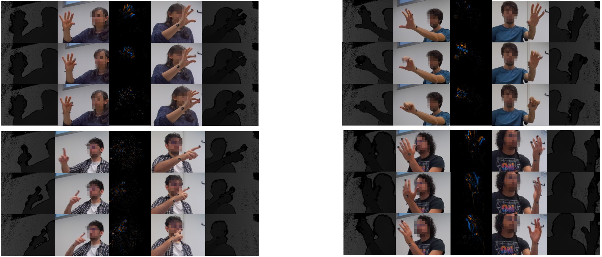

# EHWGesture - A dataset for multimodal understanding of clinical gestures

This repository introduces EHWGesture, a multimodal dataset for clinical gesture understanding (i.e., gesture recognition, triggering, action quality assessment), including RGB-Depth, Event (Neuromorphic vision) and Motion Capture data. This work will be presented at the First International Workshop on Skilled Activity Understanding Workshop of IEE/CVF ICCV 2025, Honolulu (US).



## Abstract
Hand gesture understanding is essential for several applications in human-computer interaction, including automatic clinical assessment of hand dexterity. While deep learning has advanced static gesture recognition, dynamic gesture understanding remains challenging due to complex spatiotemporal variations. Moreover, existing datasets often lack multimodal and multi-view diversity, precise ground-truth tracking, and an action quality component embedded within gestures. This paper introduces EHWGesture, a multimodal video dataset for gesture understanding featuring five clinically relevant gestures. It includes over 1,100 recordings (∼6 hours), captured from 25 healthy subjects using two high-resolution RGB-Depth cameras and an event camera. A motion capture system provides precise ground-truth hand landmark tracking, and all devices are spatially calibrated and synchronized to ensure cross-modal alignment. Moreover, to embed an action quality task within gesture understanding, collected recordings are organized in classes of execution speed that mirror clinical evaluations of hand dexterity. Baseline experiments highlight the dataset’s potential for gesture classification, gesture trigger detection, and action quality assessment. Thus, EHWGesture can serve as a comprehensive benchmark for advancing multimodal clinical gesture understanding.

## Data availability
The EHWGesture is publicly available for download here under CCBY4 license: [EHWGesture-download here](https://drive.cloud.polito.it/index.php/s/5cFBs6HFtrK7PXf). Volunteers faces were anonymized and any usage excluded from educational and research purposes is not allowed. We hold no liability for any undesiderable consequences of using the database. 

## Release Notes
EHWGesture v1.0:
- First release is online! MOCAP data for test subjects are already available, while those for the remaining subjects are currently under processing and will be soon available for all subjects. 

## Dataset content and structure 

The dataset contains separate folders for each modality, annotations, global calibration among all sensors and additional metadata. EHWGesture folder structure is as follows:

```text
EHWGESTURE/
├── Annotations/
│   └── GestureTriggers/
│       ├── X##/                          # Replace X## with subject/session IDs (e.g., X01–X25)
│       │   └── Left/, Right/
│       │       └── [Gesture]/            # Replace [Gesture] with gesture codes (e.g., FTF1, NOSE2, etc.)
│       │           └── *_triggers.csv    # Trigger metadata for each gesture
│
├── DataEvent/
│   ├── X##/
│   │   └── X##_LEFT/, X##_RIGHT/
│   │       └── [GestureGroup]/           # High-level categories like FT, NOSE, OC, PS, TR
│   │           └── *.aedat4              # Event-based camera data files
│
├── DataKinects/
│   ├── X##/
│   │   ├── Left/
│   │   │   ├── X##_L_lags.csv            # Synchronization lag metadata (left side)
│   │   │   ├── depth/
│   │   │   │   └── Prova_[Gesture]/      # Kinect depth videos per gesture
│   │   │   │       ├── master_*.mp4
│   │   │   │       └── sub2_*.mp4
│   │   │   ├── rgb/
│   │   │   │   └── Prova_[Gesture]/      # Corresponding RGB videos per gesture
│   │   │   │       ├── master_*.mp4
│   │   │   │       └── sub2_*.mp4
│   │   │   └── metadata/
│   │   │       └── AlignedTimestamps/
│   │   │           └── *_sync_frames.csv # Frame-level alignment metadata
│   │   └── Right/
│   │       ├── X##_R_lags.csv
│   │       ├── depth/
│   │       │   └── Prova_[Gesture]/
│   │       ├── rgb/
│   │       │   └── Prova_[Gesture]/
│   │       └── metadata/
│   │           └── AlignedTimestamps/
│   │               └── *_sync_frames.csv
│
├── DataMOCAP/
│   ├── X##/
│   │   ├── Left/
│   │   │   └── [Gesture].csv             # 3D body joint positions per gesture (left)
│   │   └── Right/
│   │       └── [Gesture].csv             # 3D body joint positions per gesture (right)
│
├── GlobalCalibration/
│   ├── FramesEvent/
│   │   └── pos1.png, pos2.png, ...       # Static calibration frames from the event camera
│   ├── FramesMasterKinect/
│   │   └── pos##_rgb####.png             # RGB calibration frames from master Kinect
│   └── FramesSubKinect/
│       └── pos##_rgb####.png             # RGB calibration frames from sub Kinect
│
└── Metadata/
    ├── Train_test_split.csv              # Subject-wise data split definition
    ├── RecordingConfigKinects/
    │   ├── master_kinect_config.json     # Kinect setup config for master
    │   └── sub_kinect_config.json        # Kinect setup config for sub
    └── VendorCalibrationKinects/
        ├── master_kinect_config.json     # Vendor-provided master Kinect calibration
        └── sub_kinect_config.json        # Vendor-provided sub Kinect calibration
```

## Contents
This Github repository contains the main scripts for reproducing the baseline experiments presented in the original publication. For our baseline experiments, we randomly picked up subjects X1, X5, X8, X17, X25 as test subjects. Therefore, consider those subjects when benchmarking your own results. For reproducibility, the following scripts are provided:

### ScriptsEvent
- `aedat_analizer_script.py`: Analyze AEDAT files.
- `extract_event_frames.py`: Extract frames from event data.
- `find_sync_triggers_event.py`: Find synchronization triggers in event data.
- `hand_trajectory_parallel_extraction_event.py`: Extract hand trajectories in parallel from event data.
- `visualize_npy_event.py`: Visualize `.npy` event data.

### ScriptsKinects
- `hand_trajectory_parallel_extraction.py`: Extract hand trajectories in parallel from Kinect data - useful to identify cropping windows
- `hand_trajetory_plotting.py`: Plot hand positions from raw data.

### ScriptsMOCAP
- `groundtruth_for_triggering.py`: Generate ground truth for triggering.
- `temporal_reallignment.py`: Perform temporal realignment of MOCAP data.
- `TrackingData.py`: Handle tracking data.

### TrainingCode
- `exp_num_frames.sh`: Paper experiment for window length.
- `exp_time_downsample.sh`: Paper experiment for time downsampling.
- `main.py`: Main script for training.

### TriggerDetection
- Scripts for the event localization task

## Citations
If you use our dataset, please cite:
```text
```
