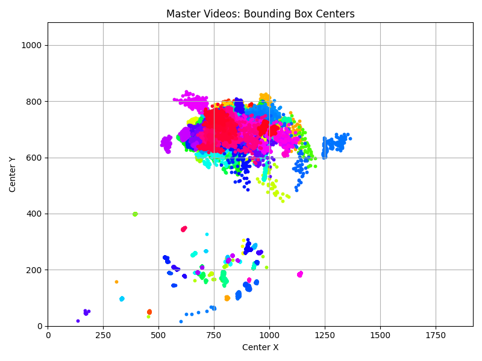
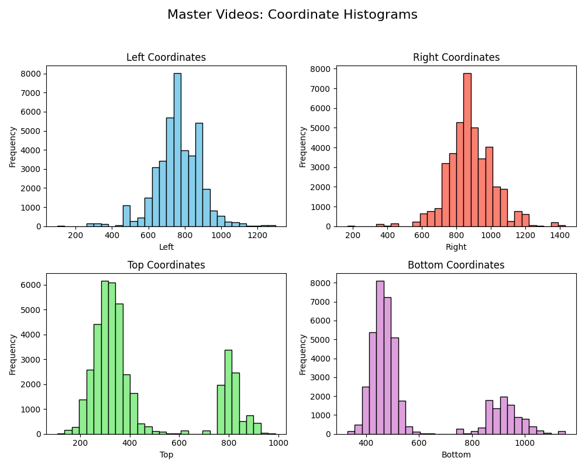
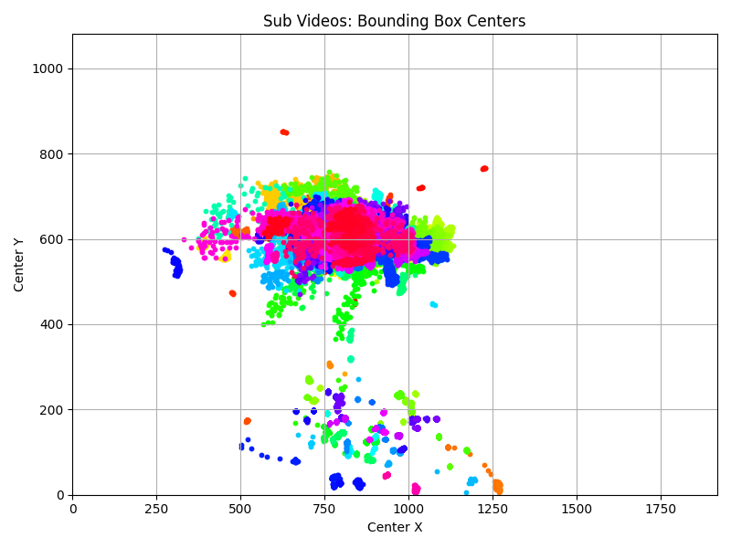
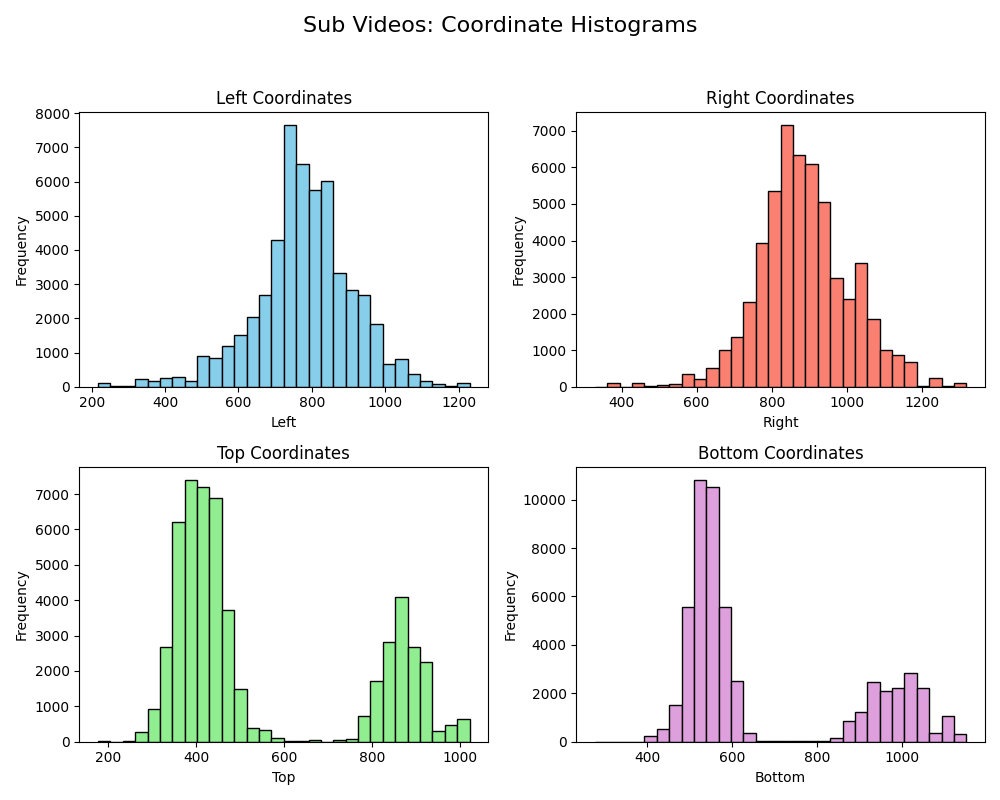

# Hand Trajectory Extraction and Plotting
This repository contains two Python scripts to extract and visualize hand trajectories from video recordings (e.g., Kinect recordings) using MediaPipe. The extraction script processes videos in parallel and outputs text files with bounding box coordinates, while the plotting script reads these text files to generate visualizations.

## ``hand_trajectory_parallel_extraction.py``
### Purpose:
Extracts hand trajectories from video files by detecting hand landmarks with MediaPipe.
Processes videos concurrently (default 8 at a time) and writes each video’s output to a text file in a folder (``output/``).

### Output Format:
Each output text file contains one line per detected hand in a frame, with four space-separated numbers:


``left right top bottom``

## ``hand_trajetory_plotting.py``
### Purpose:
Reads all the text files produced in the traj_output folder, separates them into two groups based on the presence of master or sub in their filenames, and generates visualizations.


## Requirements

Python 3.x\
OpenCV\
MediaPipe\
pyk4a-bundle\
Tqdm\
Matplotlib\
Numpy


```
pip install opencv-python mediapipe pyk4a-bundle tqdm matplotlib numpy
```

## Usage
1. Extracting Hand Trajectories\
Run the extraction script:\
``python hand_trajectory_parallel_extraction.py``

2. Plotting Hand Trajectories\
After extraction, run the plotting script:\
``python hand_trajetory_plotting.py``

Scatter plots for bounding box centers (one plot for all ``master`` videos and one for all ``sub`` videos).\
Four histograms for each group showing the distributions of the left, right, top, and bottom coordinates.

## Example output

### Master Videos



### Sub Videos

